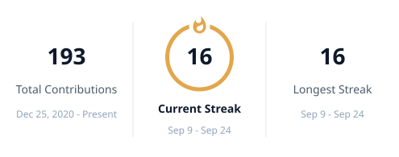

## 🧭 About me

I turn complex business problems into systems, data and intelligence. From information systems and
process analysis, through data engineering, to business intelligence and AI — I build solutions that
make complexity understandable, data usable and decisions dependable.

Business Intelligence Engineer, 4+ years across telecom, pharmaceutical distribution, manufacturing
and marketplace operations. M.Sc. in Industrial Engineering, Kharazmi University. Based in Karaj,
Iran, and open to remote work and relocation.

**Currently**

- Freelance BI engineer: ETL, warehouse design, Power BI dashboards, KPI frameworks
- Publishing open analytics projects across finance, banking, retail, pharma, energy and public data
- Writing [a Persian question bank for data interviews](https://miladshabani.ir/data-interview/), free and growing

## 🏗️ Selected experience

<table>
<tr><td><b>Asiatech</b></td><td>Data warehouse serving <b>500M+ records</b>, with the ETL and OLAP layers on top</td></tr>
<tr><td><b>Samanehaye Modiriat</b></td><td>BI and CRM delivery for <b>MAPNA, Digikala, MCI, Saba Battery</b></td></tr>
<tr><td><b>EltiamPharm</b></td><td>C#/SSIS pipeline pulling from the APIs of <b>15 pharmaceutical distributors</b> into one warehouse</td></tr>
<tr><td><b>Health Network Malard</b></td><td>Vaccine demand forecasting and vaccinator scheduling during the COVID-19 campaign</td></tr>
</table>

## 📂 Featured projects

<table>
<tr>
<td width="50%" valign="top">

**[Delivery Marketplace: Growth or Profit?](https://github.com/Milad-Shabani/delivery-marketplace-analytics-engine)**

Orders growing 65% a year on a contribution margin under 7%. Per-city P&L, cohorts, a 12-month
forecast and a constrained reallocation of the promotion budget.

</td>
<td width="50%" valign="top">

**[People Analytics: Who Is About to Resign?](https://github.com/Milad-Shabani/hr-analytics-dashboard)**

An attrition-risk score with published weights, a live-formula Excel workbook as the source of
truth, and a 12-month hiring plan per department.

</td>
</tr>
<tr>
<td width="50%" valign="top">

**[Finance & FP&A: Which Budget Line Is Slipping?](https://github.com/Milad-Shabani/finance-analytics-dashboard)**

A fully tied three-statement model that balances to the penny, a 12-month revenue, EBITDA and
cash-flow forecast, and an explainable budget-overrun risk model.

</td>
<td width="50%" valign="top">

**[Retail Banking: Which Transaction Is Suspicious?](https://github.com/Milad-Shabani/retail-banking-analytics)**

Customer and transaction analytics with a suspicious-transaction model, and a dashboard that puts
risk, customer behaviour and portfolio health side by side.

</td>
</tr>
<tr>
<td width="50%" valign="top">

**[Global Gold: Who Is Quietly Buying?](https://github.com/Milad-Shabani/global-gold-market-pulse-2026)**

Real World Gold Council and IMF data on official reserves, production and demand — 26 years of
reserve history, reconciled across sources with different methodologies.

</td>
<td width="50%" valign="top">

**[Unemployment Halved. Employment Didn't.](https://github.com/Milad-Shabani/iran-population-labour-dashboard)** · [live](https://milad-shabani.github.io/iran-population-labour-dashboard/)

Official unemployment fell from 12.4% to 7.5% while participation dropped 2.6 points. A bilingual
data story with a model whose assumptions you can change.

</td>
</tr>
</table>

Also here: [Supermarket Marketplace](https://github.com/Milad-Shabani/marketco-marketplace-intelligence) (780K rows, LightGBM quantile forecasting, RFM churn) · [Battery Plant S&OP](https://github.com/Milad-Shabani/battery-crm-sop-planning-engine) (CRM pipeline into the forecast, capacity as an LP, MRP) · [Pharma Supply Chain](https://github.com/Milad-Shabani/Pharmapulse-supply-chain-intelligence) (ABC/XYZ, quantile reorder points, cash conversion cycle) · [Global EV Market](https://github.com/Milad-Shabani/Global-EV-market-pulse) · [Food Manufacturing S&OP](https://github.com/Milad-Shabani/Food-manufacturing-sop-planning-engine) · [Resource & Capacity Planning](https://github.com/Milad-Shabani/Resource-planning-capacity-forecasting) · [User Analytics Pipeline](https://github.com/Milad-Shabani/User-analytics-data-pipeline) · [COVID Vaccination Forecasting](https://github.com/Milad-Shabani/covid-vaccination-demand-forecasting) · [Power BI Daily Sales](https://github.com/Milad-Shabani/Powerbi-analytics-online-market)

## 🧰 Tech stack

<table>
<tr>
<td><b>BI &amp; reporting</b></td>
<td>

</td>
</tr>
<tr>
<td><b>Data &amp; warehouse</b></td>
<td>

</td>
</tr>
<tr>
<td><b>Python &amp; modeling</b></td>
<td>

</td>
</tr>
<tr>
<td><b>Dashboards &amp; delivery</b></td>
<td>

</td>
</tr>
<tr>
<td><b>Enterprise &amp; process</b></td>
<td>

</td>
</tr>
</table>

## 📚 Research & writing

- M.Sc. thesis: a sustainable EV battery supply chain under uncertainty, with a data-mining approach to scenario generation
- B.Sc. project: a review of data-mining methods for breast cancer prediction
- [Persian question bank for data interviews](https://miladshabani.ir/data-interview/), plus teaching and Power BI training for teams

## 📊 Activity

## 🤝 Let's work together

Open to collaboration: BI and analytics engineering roles, freelance warehouse and dashboard builds,
and Power BI training for teams.

I work in Persian and English.

